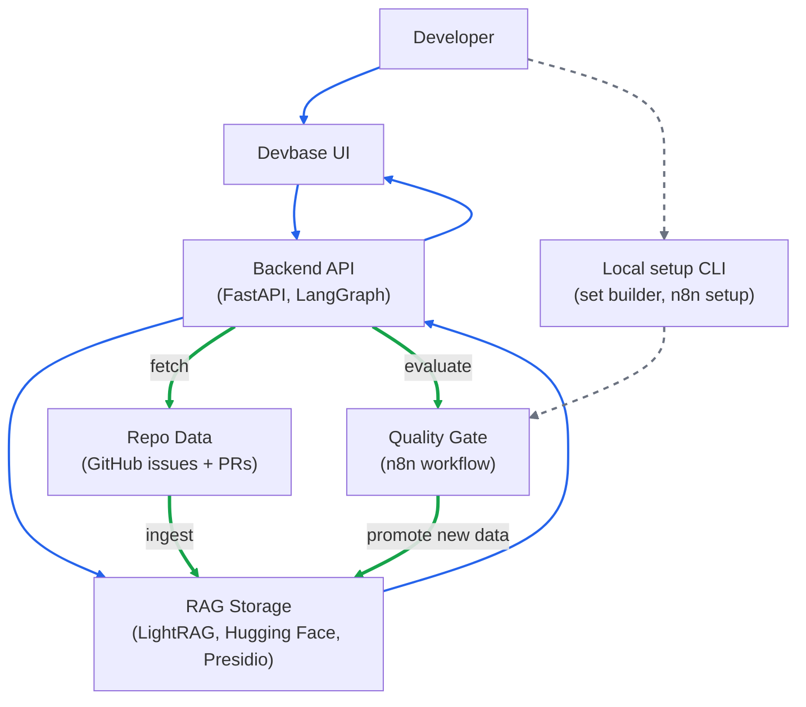

#  Devbase 

Devbase helps developers review risks before making changes in code, by querying repo history from GitHub issues and pull requests in a <ins>RAG system</ins>.

It uses <ins>eval gates</ins> in a workflow runner so that teams can continue to update and refer to repo data in the continuously reliable RAG.

#### Built using:
[](https://www.langchain.com/langgraph)
[](https://huggingface.co/docs)
[](https://docs.n8n.io)
[](https://github.com/hkuds/lightrag)
[](https://github.com/microsoft/presidio)
[](https://fastapi.tiangolo.com)
[](https://react.dev)
[](https://www.docker.com)

<br><br>

## Demo 
#### 🡳 Click image to watch demonstration + instructions for setup
<br>
<kbd>
    <a href="https://youtu.be/rkbrAXk-rWw"> 
        
    </a>
</kbd>

<br><br>

## Tech Stack

| AI Orchestration      | API & Web         | Eval & Monitoring  |
| --------- |-------------| ------------- |
| <ul><li>**LangGraph** -> workflow orchestration</li><li>**Hugging Face** -> LLM and embedding models</li><li>**LightRAG** -> RAG storage/retrieval</li><li>**Presidio** -> prompt-injection screening</li></ul> | <ul><li>**Python** -> FastAPI REST</li><li>**React** -> Vite, Chakra UI</li><li>**Docker** ->runs n8n container</li></ul> | <ul><li>**n8n** -> eval workflow </li><li>**Braintrust** -> observability</li></ul>

<br>

## Architecture



# Setup Instructions

## Configure Environment

Create your local `.env` file from the template:

```cmd
copy .env.example .env
```

### Required

- `HF_TOKEN`: required for LightRAG to call Hugging Face LLM and embedding models.

### Optional
- `GITHUB_TOKEN`: needed for private repos or higher GitHub API rate limits
- `BRAINTRUST_API_KEY`: enables eval logging/monitoring

### Modifiable

- `HF_LLM_MODEL`: Hugging Face chat model used for report generation
- `HF_EMBEDDING_MODEL`: Hugging Face embedding model used by LightRAG
- `HF_PROVIDER`: Hugging Face inference provider. Keep `auto` unless you need a specific provider

<br>

## Install Dependencies

From the project root, install dependencies:

```cmd
pip install -r requirements.txt
```

<br>

## Build Golden Set
Golden set cases are repo-scoped. The file: `golden_test_set.jsonl` contains cases for each repo that has been fetched using Devbase. 

- The eval process only uses cases for the repo being updated.
- Rebuilding for the same repo replaces that repo's cases and keeps cases for other repos.

<br>

> [!NOTE]
> A specific repo's <ins>golden set</ins> contains data pairs, each consisting of:
> 1. example case of your proposed code change
> 2. the sources that the RAG should cite

<br>

### Run the builder:

```cmd
python -m scripts.build_golden_set
```

The CLI asks for:

- `Repository owner/repo`: target repo, for example `micattoc/devbase`
- `Issues to fetch`: number of issue records
- `Pull requests to fetch`: number of PR records

<br>

For each generated candidate (records that have a `score` of `3+`):

- `y`: approve case
- `n`: reject case
- `e`: edit prompt before saving
- `q`: stop review

<br>

> [!NOTE]
> Candidate `score` is a heuristic (calculated when record is fetched):
> - `+1` when title/body contains high-signal words like `bug`, `regression`, `breaking`, `compatibility`, `fix`, `route`, `request`, or `body`
> - `+2` when labels contain those high-signal words
> - `+1` when the record is an issue or pull request
> - `+3` when the text links to another GitHub record with `fixes`, `closes`, or `resolves #...`
> - `+1` when the record has a URL
> 
> Higher score means the record is more likely to become a useful eval case.
> 
> The CLI shows up to 10 candidates, ranked by score, after dropping records below the minimum score threshold of `3`.

<br>

## Setup n8n Workflow

n8n runs the eval process: golden set evalution, promote staging RAG data only if eval passes, then return the result to Devbase.

> [!IMPORTANT]
> Prerequisites:
> - Docker is running
> - Golden set exists for the repo you want to update
> - FastAPI is available at `http://host.docker.internal:8000` when the workflow runs
> - Registered an account in n8n

<br>

### Run setup from the project root:

```cmd
bash scripts/setup_n8n.sh
```

The script will start `devbase_n8n` Docker container with an imported `n8n` workflow that is automatically published as a production webhook at:
```text
http://localhost:5678/webhook/kb-updated
```

You can view and modify the `n8n` workflow executions + stages at:
```text
http://localhost:5678
```


<br>

## Run Devbase

### Run backend

From the project root:
```cmd
uvicorn api.rest_api:app --reload --port 8000
```

### Run the UI

In a second terminal:
```cmd
cd web
npm run dev
```

### Open on browser

```text
http://localhost:5173
```

---
<div align="center">
    

<p align="center">
    Developed by
</p>

<div align="center"> 

[](https://www.linkedin.com/in/sophia-halapchuk)
[](https://github.com/micattoc)

</div>


