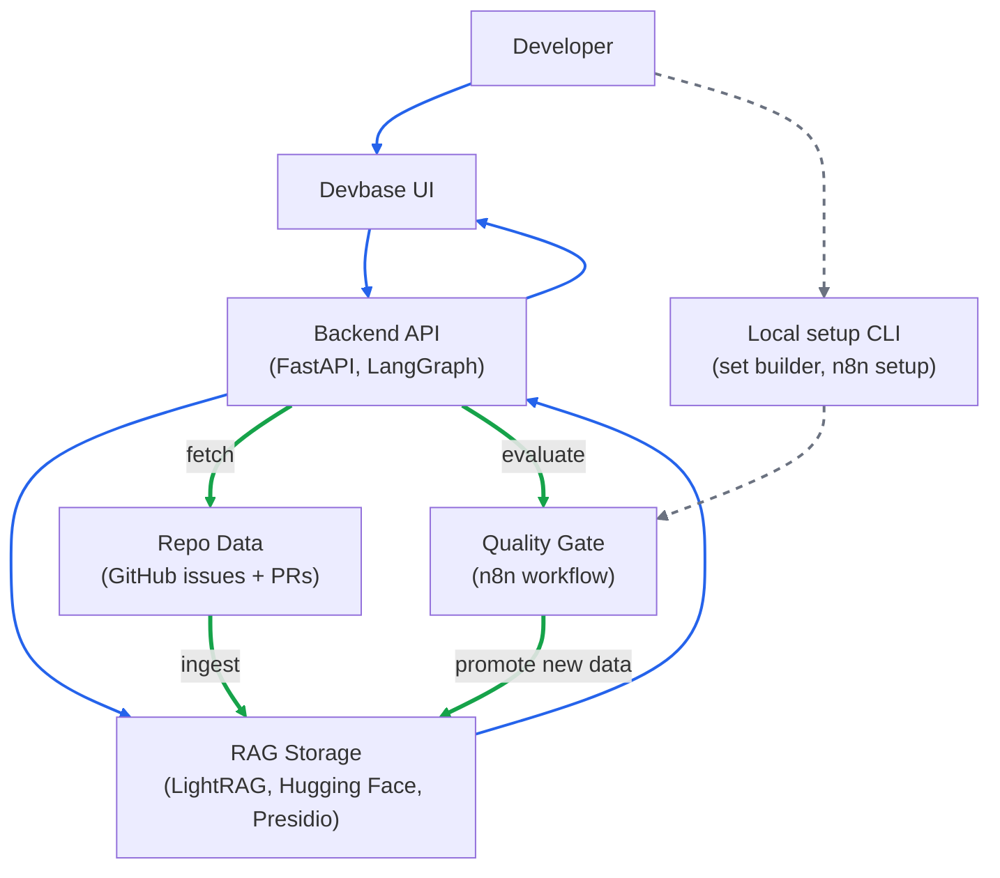

# Devbase

Devbase helps developers review risks before making changes in code, by querying repo history from GitHub issues and pull requests in a RAG system.

It uses eval gates in a workflow runner so that teams can continue to update and refer to repo data in the RAG - which holds the same quality over time.

## Demo 
#### Click following image to watch demonstration and setup instructions.
[](https://youtu.be/rkbrAXk-rWw)

## Tech Stack

### AI Orchestration:
- **LightRAG**: graph-based RAG storage and retrieval
- **Hugging Face**: LLM and embedding models for LightRAG
- **LangGraph**: risk-review workflow orchestration
- **Presidio**: prompt-injection screening and blocking requests

### AI Eval:
- **n8n**: quality-gate workflow runner
- **Braintrust**: eval observability for regression tracking

### Full Stack:
- **Python**: FastAPI REST, GitHub REST, scripts [backend]
- **React**: Vite and Chakra UI [frontend]
- **Docker**: runs n8n via container


## Architecture



## Build Golden Set

Golden set cases are repo-scoped. One file can contain cases for multiple repos, but eval only uses cases for the repo being updated.

Run the builder:

```cmd
python -m scripts.build_golden_set
```

The CLI asks for:

- `Repository owner/repo`: target repo, for example `mockoon/mockoon`
- `Issues to fetch`: issue records to inspect
- `Pull requests to fetch`: PR records to inspect

For each generated candidate:

- `y`: approve case
- `n`: reject case
- `e`: edit prompt before saving
- `q`: stop review

Candidate `score` is a heuristic:

- `+1` when title/body contains high-signal words like `bug`, `regression`, `breaking`, `compatibility`, `fix`, `route`, `request`, or `body`
- `+2` when labels contain those high-signal words
- `+1` when the record is an issue or pull request
- `+3` when the text links to another GitHub record with `fixes`, `closes`, or `resolves #...`
- `+1` when the record has a URL

Higher score means the record is more likely to become a useful eval case.
The CLI shows up to 10 candidates, ranked by score, after dropping records below the minimum score threshold.

Approved cases are saved to:

```text
data/golden_test_set.jsonl
```

Rebuilding for the same repo replaces that repo's cases and keeps cases for other repos.

## Setup n8n Workflow

n8n runs the eval gate: run golden-set eval, promote staging RAG data only if eval passes, then return the result to Devbase.

Prerequisites:

- Docker Desktop is running
- Golden set exists for the repo you want to update
- FastAPI will be available at `http://host.docker.internal:8000` when the workflow runs

Run setup from the project root:

```cmd
bash scripts/setup_n8n.sh
```

The script will:

- start the `devbase_n8n` Docker container
- import `workflows/n8n_quality_gate.json`
- publish the workflow webhook
- write setup status to `.devbase/n8n_setup.json`

Production webhook:

```text
http://localhost:5678/webhook/kb-updated
```

Devbase uses this by default through `N8N_QUALITY_GATE_WEBHOOK_URL`.

## Run Locally

Run FastAPI from the project root:

```cmd
uvicorn api.rest_api:app --reload --port 8000
```

Run the UI in a second terminal:

```cmd
cd web
npm run dev
```

Open the UI at:

```text
http://localhost:5173
```
